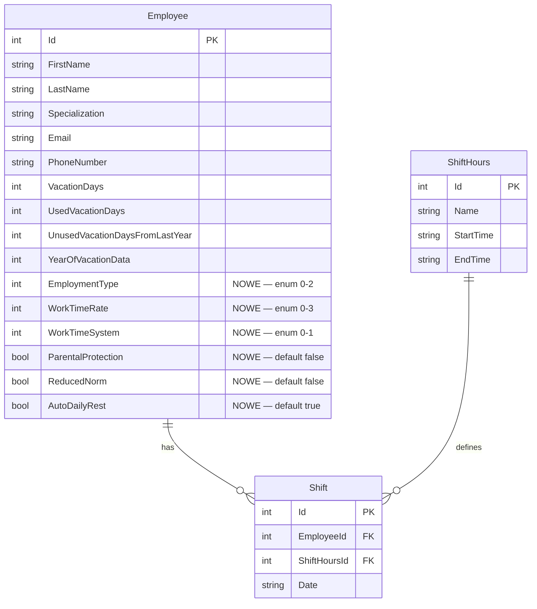

# feat: Rozbudowa karty pracownika — pełny profil z wymiarami czasu pracy i ograniczeniami prawnymi

## Overview

Rozbudowa modelu `Employee` oraz karty pracownika w zakładce **Pracownicy** o pełny zestaw danych kadrowych: formę zatrudnienia, wymiar etatu, system czasu pracy, twarde ograniczenia prawne (ochrona rodzicielska, norma skrócona, odpoczynek dobowy) oraz ulepszony podgląd salda urlopowego. Zmiany obejmują schemat bazy danych (migracja SQLite), model C#, formularz edycji, widok karty oraz fundamenty walidacji w grafiku.

## Problem Statement / Motivation

Obecna karta pracownika przechowuje jedynie imię, nazwisko, specjalizację, kontakt i urlopy. Brakuje kluczowych informacji niezbędnych do:

1. **Wyliczania normy godzinowej** — bez wymiaru etatu i systemu czasu pracy nie wiadomo, ile godzin w miesiącu ma przepracować dany pracownik.
2. **Walidacji grafiku** — bez flag prawnych (ochrona rodzicielska, norma skrócona) system nie może blokować/ostrzegać przed niezgodnym grafikiem.
3. **Śledzenia urlopów** — brak czytelnego podglądu „wykorzystano / pozostało" z wyróżnieniem przekroczeń.

## Proposed Solution

### Faza 1: Schemat danych + migracja
Dodanie 6 nowych kolumn do tabeli `Employee` w SQLite via istniejący wzorzec `ALTER TABLE ... ADD COLUMN` z try/catch w `DbInitialization.RunMigrations()`.

### Faza 2: Model + CRUD
Rozszerzenie `EmployeeRecord.cs` i `EmployeeTable.cs` o nowe pola z odpowiednimi typami.

### Faza 3: UI karty pracownika
Rozbudowa formularza edycji i widoku karty w `MainWindow.axaml` + code-behind.

### Faza 4: Logika normy godzinowej (fundament)
Stworzenie `NormCalculator` w `GrafikPlanerCore` — bez tego WorkTimeRate i ReducedNorm są czysto dekoracyjne.

### Faza 5: Podgląd salda urlopowego (Read-Only)
Automatyczne wyliczanie „Wykorzystano / Pozostało" z kolorowym wyróżnieniem.

## Technical Considerations

### Architektura

- **Wzorzec migracji**: `DbInitialization.RunMigrations()` — `ALTER TABLE Employee ADD COLUMN ... DEFAULT ...` z try/catch (istniejący wzorzec z linii 34-111).
- **Code-behind pattern**: Cała logika UI w `MainWindow.axaml.cs` (830 linii). Nowe pola dodajemy w tym samym wzorcu.
- **Spelling quirk**: C# model używa `Specialisation` (brytyjskie), a SQL `Specialization` (amerykańskie). Nowe pola powinny mieć spójną pisownię (proponuję polskie nazwy kolumn aby uniknąć dwuznaczności).

### Przechowywanie nowych pól

| Pole | Typ SQLite | Typ C# | Domyślna wartość | Uwagi |
|---|---|---|---|---|
| `EmploymentType` | `INTEGER NOT NULL DEFAULT 0` | `int` (enum) | `0` = UmowaPrace | Enum: 0=UmowaPrace, 1=Zlecenie, 2=B2B |
| `WorkTimeRate` | `INTEGER NOT NULL DEFAULT 0` | `int` (enum) | `0` = Full (1/1) | Enum: 0=Full, 1=ThreeQuarters, 2=Half, 3=Quarter |
| `WorkTimeSystem` | `INTEGER NOT NULL DEFAULT 0` | `int` (enum) | `0` = Podstawowy | Enum: 0=Podstawowy, 1=Rownowazny |
| `ParentalProtection` | `INTEGER NOT NULL DEFAULT 0` | `bool` | `false` | Blokuje >8h i pracę nocną |
| `ReducedNorm` | `INTEGER NOT NULL DEFAULT 0` | `bool` | `false` | Norma dobowa 7h zamiast 8h |
| `AutoDailyRest` | `INTEGER NOT NULL DEFAULT 1` | `bool` | `true` | Domyślnie włączony |

### Wzór normy godzinowej

```
normaMiesięczna = dniRobocze(miesiąc) × normaDobowa × współczynnikEtatu
```

Gdzie:
- `normaDobowa` = 7h jeśli `ReducedNorm`, inaczej 8h
- `współczynnikEtatu` = 1.0 / 0.75 / 0.5 / 0.25 wg `WorkTimeRate`
- `dniRobocze` = dni robocze w danym miesiącu (pon-pt minus święta z `HolidaysTable`)

### Performance

- Żadnych nowych zapytań SQL przy ładowaniu listy — wszystkie nowe kolumny w jednym `SELECT *`.
- `NormCalculator` wywoływany on-demand przy wyświetlaniu grafiku, nie przy każdym renderze listy.

### Bezpieczeństwo danych

- Migracja dodaje kolumny z domyślnymi wartościami — istniejące dane nie zostaną utracone.
- Jednorazowy banner po migracji: „Nowe pola zostały dodane do kart pracowników — zweryfikuj dane."

## System-Wide Impact

- **Interaction graph**: Zmiana `EmployeeRecord` → wpływa na `EmployeeTable.AddEmployee/UpdateEmployee` → wpływa na `MainWindow.OnEmployeeDialogSubmitClick()` → wpływa na `ScheduleCreator` (który czyta pracowników) → wpływa na `ScheduleTableWindow` (wyświetla HoursSummary).
- **Error propagation**: Migracja z try/catch — jeśli kolumna już istnieje, jest ignorowana. Brak ryzyka utraty danych.
- **State lifecycle risks**: Zmiana `EmploymentType` na Zlecenie/B2B dla pracownika z istniejącymi urlopami — UI powinien ukryć sekcję urlopową, ale dane w DB pozostają nienaruszone.
- **API surface parity**: `GetAllEmployees()`, `AddEmployee()`, `UpdateEmployee()` — wszystkie wymagają aktualizacji o nowe kolumny.

## Acceptance Criteria

### Faza 1: Schemat + Model

- [ ] 6 nowych kolumn w tabeli `Employee` z domyślnymi wartościami (`DbInitialization.cs`)
- [ ] `EmployeeRecord.cs` rozszerzony o nowe properties z odpowiednimi typami
- [ ] Enum types: `EmploymentType`, `WorkTimeRate`, `WorkTimeSystem` w `GrafikPlanerData/Models/`
- [ ] `EmployeeTable.cs`: `AddEmployee()` i `UpdateEmployee()` zapisują nowe pola
- [ ] `EmployeeTable.cs`: `GetAllEmployees()` czyta nowe pola
- [ ] Istniejący pracownicy po migracji mają sensowne domyślne wartości

### Faza 2: UI — Formularz edycji (`MainWindow.axaml`)

- [ ] Sekcja **Wymiar czasu pracy**: ComboBox `Forma zatrudnienia` (3 opcje), ComboBox `Wymiar etatu` (4 opcje), ComboBox `System czasu pracy` (2 opcje)
- [ ] Sekcja **Ograniczenia prawne**: 3 CheckBoxy z opisami (Ochrona rodzicielska, Norma skrócona, Automatyczny odpoczynek dobowy)
- [ ] Dla Zlecenie/B2B: sekcja urlopowa ukryta/wyłączona, checkboxy ParentalProtection i ReducedNorm wyszarzone
- [ ] `AutoDailyRest` domyślnie zaznaczony przy nowym pracowniku

### Faza 3: UI — Widok karty (read-only detail)

- [ ] Sekcja **Wymiar czasu pracy**: wyświetla formę zatrudnienia, wymiar, system
- [ ] Sekcja **Ograniczenia prawne**: ikony/tagi dla aktywnych flag
- [ ] Sekcja **Urlopy** (ulepszona): wyświetla `Wykorzystano: X dni` i `Pozostało: Y dni`
- [ ] `Pozostało` wyświetlane na czerwono gdy <= 0
- [ ] Urlop zaległy z informacją o wygasaniu po 30 września

### Faza 4: NormCalculator

- [ ] Klasa `NormCalculator` w `GrafikPlanerCore` z metodą `Calculate(int year, int month, EmployeeRecord employee) → decimal`
- [ ] Uwzględnia: dni robocze (minus święta), normę dobową (7h/8h), współczynnik etatu
- [ ] Wynik wyświetlany w grafiku obok `HoursSummary` jako `{actual} / {norma}h`

## Decyzje otwarte (do podjęcia przed implementacją)

| # | Pytanie | Domyślne założenie | Wpływ |
|---|---|---|---|
| 1 | **ReducedNorm + Równoważny**: Czy norma skrócona (7h) ogranicza też max długość zmiany, czy tylko pulę miesięczną? | Tylko pula miesięczna (KP art. 130) | Jeśli ogranicza dzienny max → Równoważny bezużyteczny dla tego pracownika |
| 2 | **ParentalProtection**: Hard block czy soft warning? | Hard block (KP art. 178 — obowiązek prawny) | Hard block = brak override, prostsze UI |
| 3 | **AutoDailyRest**: Hard block czy soft warning? | Soft warning (żółta ikona, override możliwy) | Hard block frustruje małe zespoły |
| 4 | **Definicja pracy nocnej**: Stałe 21:00–07:00 czy konfigurowalne w ustawieniach? | Stałe 21:00–07:00 (KP art. 151⁷) | Konfiguracja = dodatkowe pole w Settings |
| 5 | **HoursSummary**: zmienić z `int` na `decimal`? | Tak — potrzebne przy 7h normach i ½h zmianach | Wymaga zmian w ScheduleRow i ScheduleTableWindow |

## Dependencies & Risks

| Ryzyko | Prawdopodobieństwo | Wpływ | Mitygacja |
|---|---|---|---|
| Migracja SQLite nie powiedzie się na istniejącej bazie | Niskie | Wysoki | Wzorzec try/catch już istnieje; testować na kopii `apteka.db` |
| `HoursSummary` zmiana int→decimal łamie istniejący kod | Średnie | Średni | Grep wszystkich użyć `HoursSummary` przed zmianą |
| Użytkownicy nie zaktualizują danych po migracji | Wysokie | Średni | Banner jednorazowy + sensowne domyślne |
| ParentalProtection enforcement wymaga definicji „noc" — brak w Settings | Wysokie | Wysoki | Faza 1-3 bez enforcement; dodać w Fazie 4+ |

## Implementation Phases

### Phase 1: Schemat + Model (fundament)

**Pliki do zmiany:**

| Plik | Zmiana |
|---|---|
| `GrafikPlanerData/DbInitialization.cs` | 6× `ALTER TABLE Employee ADD COLUMN` w `RunMigrations()` |
| `GrafikPlanerData/Models/EmployeeRecord.cs` | +6 properties |
| `GrafikPlanerData/Models/Enums/EmploymentType.cs` | **Nowy plik** — enum |
| `GrafikPlanerData/Models/Enums/WorkTimeRate.cs` | **Nowy plik** — enum |
| `GrafikPlanerData/Models/Enums/WorkTimeSystem.cs` | **Nowy plik** — enum |
| `GrafikPlanerData/DbScripts/EmployeeTable.cs` | Update `AddEmployee`, `UpdateEmployee`, `GetAllEmployees` |

**Pseudo-kod migracji (`DbInitialization.cs`):**

```csharp
// DbInitialization.cs — RunMigrations()
try { command.CommandText = "ALTER TABLE Employee ADD COLUMN EmploymentType INTEGER NOT NULL DEFAULT 0"; command.ExecuteNonQuery(); } catch { }
try { command.CommandText = "ALTER TABLE Employee ADD COLUMN WorkTimeRate INTEGER NOT NULL DEFAULT 0"; command.ExecuteNonQuery(); } catch { }
try { command.CommandText = "ALTER TABLE Employee ADD COLUMN WorkTimeSystem INTEGER NOT NULL DEFAULT 0"; command.ExecuteNonQuery(); } catch { }
try { command.CommandText = "ALTER TABLE Employee ADD COLUMN ParentalProtection INTEGER NOT NULL DEFAULT 0"; command.ExecuteNonQuery(); } catch { }
try { command.CommandText = "ALTER TABLE Employee ADD COLUMN ReducedNorm INTEGER NOT NULL DEFAULT 0"; command.ExecuteNonQuery(); } catch { }
try { command.CommandText = "ALTER TABLE Employee ADD COLUMN AutoDailyRest INTEGER NOT NULL DEFAULT 1"; command.ExecuteNonQuery(); } catch { }
```

**Enum definitions:**

```csharp
// GrafikPlanerData/Models/Enums/EmploymentType.cs
public enum EmploymentType
{
    UmowaPrace = 0,    // Umowa o pracę
    Zlecenie = 1,       // Zlecenie
    B2B = 2             // B2B
}

// GrafikPlanerData/Models/Enums/WorkTimeRate.cs
public enum WorkTimeRate
{
    Full = 0,            // 1/1 — pełny etat
    ThreeQuarters = 1,   // 3/4
    Half = 2,            // 1/2
    Quarter = 3          // 1/4
}

// GrafikPlanerData/Models/Enums/WorkTimeSystem.cs
public enum WorkTimeSystem
{
    Podstawowy = 0,      // max 8h/dobę
    Rownowazny = 1       // zgoda na 12h dyżury
}
```

### Phase 2: UI — Formularz edycji i widok karty

**Pliki do zmiany:**

| Plik | Zmiana |
|---|---|
| `GrafikPlanerUI/Views/MainWindow.axaml` | Nowe sekcje w edit form (linie ~448-535) i detail view (linie ~350-445) |
| `GrafikPlanerUI/Views/MainWindow.axaml.cs` | `ShowDetailView()`, `OnEditEmployeeClick()`, `OnEmployeeDialogSubmitClick()` — obsługa nowych pól |

**Układ formularza edycji (nowe sekcje):**

```
┌─────────────────────────────────────┐
│ Dane podstawowe (istniejące)        │
│  Imię | Nazwisko | Specjalizacja    │
│  Email | Telefon                    │
├─────────────────────────────────────┤
│ Wymiar czasu pracy (NOWE)           │
│  [Forma zatrudnienia ▼]            │
│  [Wymiar etatu ▼] [System ▼]      │
├─────────────────────────────────────┤
│ Ograniczenia prawne (NOWE)          │
│  ☐ Ochrona rodzicielska / ciąża   │
│  ☐ Norma skrócona (7h)            │
│  ☑ Automatyczny odpoczynek dobowy  │
├─────────────────────────────────────┤
│ Urlopy (rozbudowane)                │
│  Roczny limit: [__] dni            │
│  Urlop zaległy: [__] dni           │
│  ─── Podgląd ───                   │
│  Wykorzystano: 12 dni (read-only)  │
│  Pozostało: 14 dni     (read-only) │
└─────────────────────────────────────┘
```

**Logika warunkowa:**
- Gdy `EmploymentType` = Zlecenie lub B2B → ukryj sekcję Urlopy, wyszarz checkboxy ParentalProtection i ReducedNorm.
- Gdy dodawanie nowego pracownika → `AutoDailyRest` domyślnie zaznaczony.

### Phase 3: NormCalculator

**Nowy plik:** `GrafikPlanerCore/NormCalculator.cs`

```csharp
// GrafikPlanerCore/NormCalculator.cs
public static class NormCalculator
{
    public static decimal Calculate(int year, int month, EmployeeRecord employee, List<HolidayRecord> holidays)
    {
        int workingDays = CountWorkingDays(year, month, holidays);
        decimal dailyNorm = employee.ReducedNorm ? 7m : 8m;
        decimal rate = employee.WorkTimeRate switch
        {
            WorkTimeRate.Full => 1.0m,
            WorkTimeRate.ThreeQuarters => 0.75m,
            WorkTimeRate.Half => 0.5m,
            WorkTimeRate.Quarter => 0.25m,
            _ => 1.0m
        };
        return workingDays * dailyNorm * rate;
    }
}
```

### Phase 4: Podgląd salda urlopowego

**Pliki do zmiany:**

| Plik | Zmiana |
|---|---|
| `GrafikPlanerUI/Views/MainWindow.axaml` | Read-only labels „Wykorzystano" / „Pozostało" z kolorami |
| `GrafikPlanerUI/Views/MainWindow.axaml.cs` | `ShowDetailView()` — oblicz i wyświetl saldo |

**Obliczenie:**
```
pozostało = (vacationDays + unusedFromLastYear) - usedVacationDays
```
- `pozostało > 0` → zielony tekst
- `pozostało <= 0` → czerwony tekst, bold
- Jeśli `unusedFromLastYear > 0` i miesiąc < 10 → dopisek: „(w tym {X} zaległych — wygasa 30.09)"

## ERD — Zmiany w modelu Employee



## Success Metrics

- Wszystkie istniejące pracownicy mają poprawne domyślne wartości po migracji
- Formularz edycji pozwala ustawić wszystkie nowe pola
- Karta pracownika wyświetla pełny profil
- `NormCalculator` poprawnie wylicza normę dla każdej kombinacji etatu/normy
- Saldo urlopowe wyświetla się z kolorowym wyróżnieniem

## Sources & References

### Internal References

- Employee model: `GrafikPlanerData/Models/EmployeeRecord.cs`
- Employee CRUD: `GrafikPlanerData/DbScripts/EmployeeTable.cs`
- DB migrations: `GrafikPlanerData/DbInitialization.cs:34-111`
- Main window UI: `GrafikPlanerUI/Views/MainWindow.axaml:199-539`
- Main window code-behind: `GrafikPlanerUI/Views/MainWindow.axaml.cs`
- Vacation logic: `GrafikPlanerCore/CoreProgram.cs:57-107`
- Schedule row model: `GrafikPlanerCore/Models/ScheduleRow.cs`

### External References

- Kodeks Pracy art. 130 — obliczanie wymiaru czasu pracy
- Kodeks Pracy art. 151⁷ — pora nocna (21:00–07:00)
- Kodeks Pracy art. 178 — ochrona pracownic w ciąży
